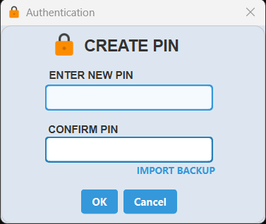
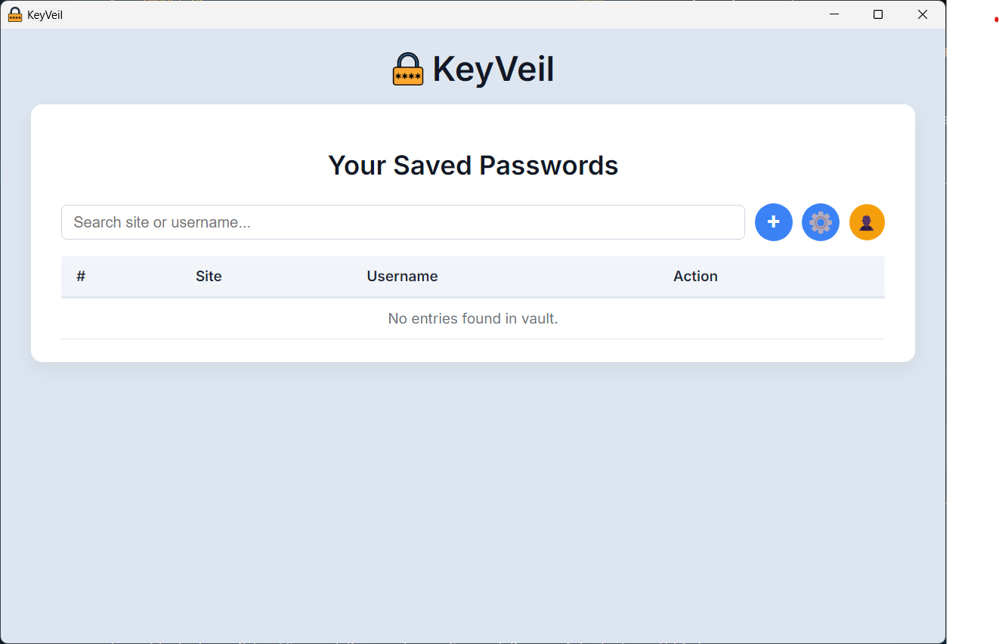

# 🔐 KeyVeil


⚠️ This project is archived and no longer maintained.

Fernet and PBKDF2 based password manager made with python for **Windows**.

KeyVeil is a light weight, local-only password manager that uses fernet for vault encryption and PBKDF2 for key derivation.

## ✨ Features
- 🔑 **Securely Encrypted** using Fernet.  
- 🔒 **Bruteforce resistent** with 1 million key derivation iterations.  
- 🗄️ **Vault storage** is local and stored in the project directory.  
- 📝 **Credential management** - includes all functions like add, edit, delete and viewing credentials.  
- 🔍 **Search bar** can we used to find any credential easily.  
- 💾 **Backup and restore backup**.  
- ✱ **PIN Change**  
- 🎲 **Password generator and import passwords from .csv**  

## 🛠️ Tech Stack
- **Python 3.9+**
- **cryptography** library (Fernet, PBKDF2HMAC)
- **JSON** (for local encrypted storage)
- **PyQt6** & **PyWebView** (GUI frontend)

## 🔧 Installation
**1. Clone the repository**  
   
 ```bash
git clone https://github.com/Shreyansh-kushw/KeyVeil.git 
cd KeyVeil
```

**2. Make a virtual environment** (Recommended)  

 ```bash
python -m venv venv
source venv/bin/activate   # Linux / macOS
venv\Scripts\activate      # Windows
```
**3. Install dependencies**  

 ```bash
pip install -r requirements.txt
```


## 🚀 Usage

**1. Run KeyVeil**

```bash
pythonw KeyVeil.pyw
```

**2. Set your PIN** (First run)



**3. Add passwords and enjoy!**




## 🔐 Security Model

- **Key Derivation**
    - **Entered pin is encoded into bytes**
    - **Salt from salt.bin and encoded pin are used to derive the key**

- **Encryption**
    - **The key is used to create a FERNET (AES-128 in CBC mode with HMAC for authentication) object**
    - **Fernet object decryptes the vault data, which is then loaded as a dict by JSON**

- **In memory safety**
    - **The pin/salt/vault data is never saved as plane text in hard drive**
    - **The key and decrypted vault data remains in memory for as long as the app is running**
    - **Sensitive variables are deleted (``del``) wherever possible**
    - **All the data is stored locally**

## ⚠️ Project Scope

KeyVeil is an offline, single-user password manager designed for local use.
It does not provide cloud sync, browser integration, or multi-device support.

## 📂 Project Structure
```
KeyVeil/
│── KeyVeil.pyw          # Entry point
│── auth.py              # Authentication
│── vault_ops.py         # Handles all CRUD operations
│── vault.py             # Encrypted vault handling
│── UI/                  # GUI files (PyQt6)
│── frontend/            # GUI files (HTML)
│── backup folder/       # backup files
│── salt.bin             # salt storage
│── vault.enc            # vault storage
│── requirements.txt     # Dependencies
│── README.md            # Project documentation
```
## ⚠️ Disclaimer

This project is just a learning implementation of a password manager app.  
Despite using some strong cryptography, it is in no way secure enough for day-to-day usage unlike production ready softwares like **Bitwarden** or **KeePassXC**.  
### Kindly use it at your own risk!
